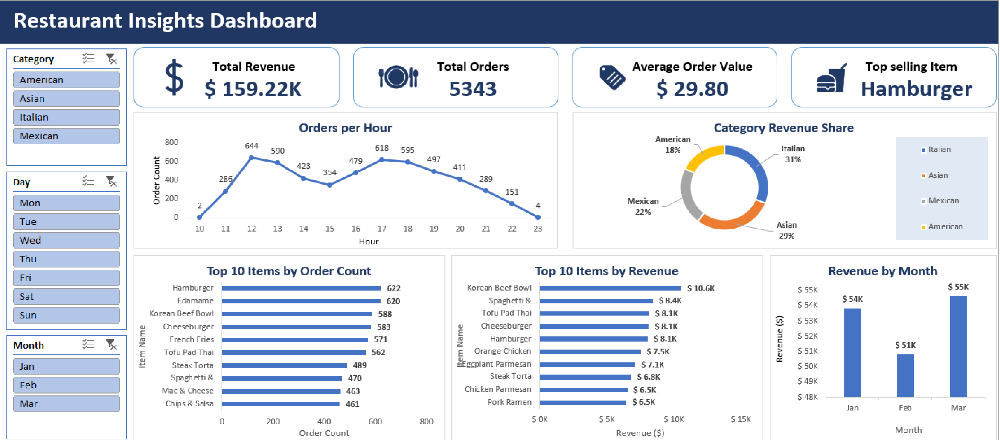

# Restaurant-Insights-Excel-Dashboard
Excel dashboard analyzing 12K+ restaurant orders — PivotTables, slicers, and advanced formulas

An interactive Excel dashboard built from a real 12,000+ row restaurant order dataset, taking it from raw, messy CSV through cleaning, cross-table joins, order-level aggregation, and pivot analysis to a slicer-driven executive dashboard.

---

## Dashboard Preview

### Restaurant Insights Dashboard

---

## Project Workflow

- **Explore & verify** — audited the raw data for type issues, missing values, and referential integrity before any analysis began.
- **Cross-table lookups** — joined item-level order data to the menu catalog.
- **Order-level aggregation** — built the item-level → order-level bridge (items_in_this_order, order_total).
- **Pivot tables** — five tables directly answering the core business questions.
- **Dashboard** — KPI cards, five charts, and cross-filtering slicers assembled into a single-page view.

---

## Tools & Techniques

- **Data cleaning:** resolved several real-world data quality issues — a date locale mismatch (US-format text dates corrected via Text to Columns with an explicit MDY override, avoiding locale-dependent DATEVALUE(), 137 rows where item_id held the literal text "NULL" rather than a true blank, and a formula-stored-as-text bug from inherited cell formatting.
  
- **Cross-table lookups:** INDEX/MATCH wrapped in IFERROR joining order_details to menu_items on item_id (used over XLOOKUP for compatibility with older Excel versions).

- **Order-level aggregation from item-level data:** order_details is one row per item, not per order — items_in_this_order (COUNTIF) and order_total (SUMIF) bridge item-level rows up to order-level totals.

- **Distinct-order counting:** an incremental first-occurrence flag (=IF(COUNTIF($B$2:B2,B2)=1,1,0)), used both for the Total Orders KPI and inside the Orders per Hour pivot (Sum of Order_count, not Count of order_details_id) so multi-item orders aren't double-counted by hour — plus a MAX-based lookup for Top Selling Item, robust to the underlying pivot being re-sorted.

- **PivotTables & slicers:** five pivot tables (item count, item revenue, hourly, monthly, category), cross-filtered by Category, Weekday, and Month slicers.

---

## Business Questions Answered

- **What are the most ordered items, and which categories do they belong to?** — Top 10 Items by Order Count chart.
- **Are there time-of-day patterns in ordering?** — Orders per Hour chart.
- **Which cuisine/category should the restaurant focus on expanding?** — Category Revenue Share donut and Revenue by Category pivot.
- **Does item popularity align with profitability?** — Top 10 Items by Order Count vs. Top 10 Items by Revenue, compared side by side.
- **Is revenue trending up or down across the quarter?** — Revenue by Month chart.

---

## Key Insights

- Hamburger is the most-ordered item (622 orders), but Korean Beef Bowl generates more total revenue ($10.55K vs. $8.05K) — popularity and profitability aren't the same thing, and a menu strategy built purely on order count would miss this.

- Italian cuisine drives 31% of total revenue despite a comparable order count to Asian (29%) — consistent with a higher average item price, and the strongest case in the data for which category to expand.
  
- Demand is sharply bimodal, peaking at lunch (12PM, 644 orders) and dinner (5PM, 618 orders) with a real trough between (2–3PM, ~354 orders) — a direct staffing-schedule input, not just a chart for its own sake.

---

## Repository Structure

- `Restaurant_orders_analysis.xlsx` — the full workbook (raw data, pivots, dashboard)
- `screenshots/` — dashboard, pivot table, and formula examples for quick preview

